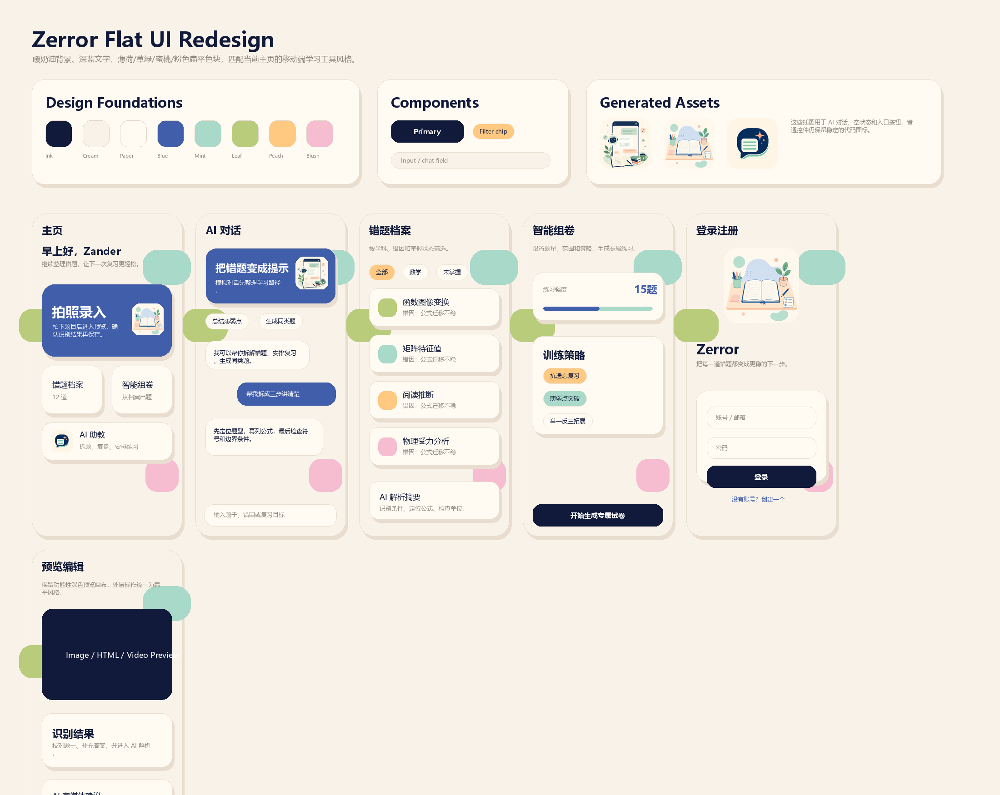
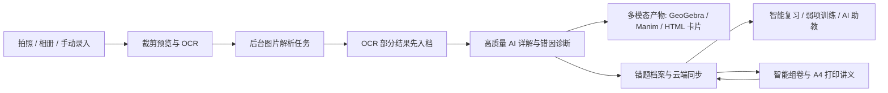

<div align="center">
  

  <h1 style="font-family: 'Orbitron', sans-serif;">🌱 知芽 Zerror</h1>

  <p>
    <strong>不在错误中焦虑，让知识在灵感中发芽 | 面向中学学习场景的 AIGC 智能错题成长应用</strong>
  </p>

  <p>
    
    
    
    
    <br/>
    
    
    
    
  </p>

  <p><em>🏆 vivo × 南开大学 AIGC 创新大赛“错题都队”参赛作品</em></p>
</div>

---

# 📖 项目简介

传统错题本更多承担“记录错误”的功能，却很少真正帮助用户**理解错误、消化错误、转化错误**。对于许多中学生来说，错题积累得越多，焦虑感反而越强，复习过程也容易陷入机械重复、缺少反馈和动力的泥潭。

**知芽 Zerror** 以“**AI 错题重构**”为核心思路，将错题整理从静态记录升级为动态成长系统。项目围绕“**识别 - 诊断 - 重构 - 训练 - 复习**”的闭环展开，通过图片识别、AI 解析、学习产物生成、智能组卷和云端同步，让每一次错误都不只是被记录下来，而是被进一步理解、利用和延展。

**🚀 当前版本更新进展：**
当前版本已经从早期界面原型推进到具备**Flutter 客户端、FastAPI 后端、账号体系、云端状态同步、腾讯云 COS 上传、vivo OCR / 文本 / 图像模型链路、后台任务队列与本地 Manim 渲染**的可运行工程。项目不再只是概念展示，而是朝着真实学习应用继续落地。

**当前已打通的核心链路：**
- 用户注册、登录、自动登录、会话校验与退出
- 拍照 / 相册 / 手动录入错题，并支持图片裁剪预览
- vivo OCR 提取题干，先保存 OCR 结果，再后台生成高质量详解
- 文本分析、图片分析、错因诊断、知识点标签、复习计划与相似题生成
- 数学 GeoGebra 交互图、物理 / 数学 Manim 视频、HTML 学习卡片等多模态学习产物
- 智能组卷：根据错题档案生成专题练习、A4 打印讲义和参考答案
- AI 助教：围绕错题档案进行快问快答、错题记忆、知识关联和考前短复习
- 错题档案、收藏、回收站、学习计划、数据看板、成长成就与云端同步

---

## 📸 项目一览

> 当前仓库暂未补充真机运行截图；这里先展示仓库中真实可用的品牌与界面素材，后续可补充手机端运行截图。

| 品牌入口 | 学习氛围 | AI 助教 |
| :---: | :---: | :---: |
| <br>**知芽品牌标识** | <br>**错题成长视觉资产** | <br>**助教对话视觉资产** |
| <br>**移动端启动视觉** | <br>**空档案 / 引导状态** | <br>**Flat UI 设计导出** |

---

## ✨ 核心功能亮点

### 1. 📸 智能错题收录
- **多渠道导入**：支持拍照上传、图片导入与手动录入。
- **裁剪与预览**：图片进入解析前可在移动端进行框选裁剪，减少无关背景对 OCR 的干扰。
- **OCR 减负**：结合 vivo OCR 提取题面文本，并进行题干清洗与规范化处理，降低手抄错题成本。

### 2. 🧠 知芽 AI 深度解析
- **两阶段图片解析**：后台任务先返回 OCR 与基础档案，再继续生成高质量详解；即使模型超时，也能保留题干和基础信息。
- **结构化诊断**：围绕题目生成知识点、步骤拆解、错因定位、复习建议和相似题。
- **文本 / 图片双链路**：既支持纯文本分析，也打通“图片上传 → OCR → AI 解析 → 错题入档”的完整视觉链路。

### 3. 🎞️ 多模态学习产物
- **数学可视化**：可生成 GeoGebra 交互图，支持函数、圆锥曲线、几何关系等场景。
- **Manim 视频讲解**：后端提供本地 Manim 渲染任务，前端轮询进度并支持视频预览、保留与清理。
- **HTML 学习卡片**：对部分物理、化学、生物、编程等内容生成可嵌入 WebView 的学习产物。

### 4. 📝 智能组卷与讲义
- **错题驱动组卷**：根据错题档案中的学科、知识点、错因和已有解析生成专题练习。
- **讲义结构完整**：包含学习目标、作答提醒、核心概念、公式卡片、题型模型、例题讲解、练习区和参考答案。
- **练习回流**：组卷练习中的错题可以继续回流到错题档案，形成二次巩固。

### 5. 🤖 AI 助教
- **四种模式**：快问快答、错题档案记忆、主动关联知识点、考前短时复习。
- **读取学习画像**：结合总错题数、待复习数、薄弱学科、薄弱知识点和错题节选生成建议。
- **可用性兜底**：AI 服务暂不可用时，会基于本地错题档案生成简洁建议，不中断学习流程。

### 6. ☁️ 云端同步与账号体系
- **完整账号系统**：支持注册、登录、自动登录、会话持久化和退出。
- **状态快照同步**：错题记录、收藏、掌握程度、用户资料、设备信息等通过 `/api/v1/app-state/{sync_user_id}` 同步。
- **对象存储支持**：错题图片、头像等媒体文件上传至腾讯云 COS，并在状态快照中保留文件引用。

### 7. 🌱 复习闭环与成长体验
- **从错题走向训练**：不仅提示“错了”，更引导“为什么错、以后如何避免、下一轮练什么”。
- **学习计划与弱项训练**：提供智能复习、薄弱点闯关、学习计划、数据看板和成就页面。
- **后台任务提醒**：图片解析与组卷任务可在后台执行，前端保留进度、失败重试和完成提醒。

---

## 🔁 当前主链路



---

## 💡 设计解读与创新评估

### 一、理念贯穿性
项目的核心理念是：**“不在错误中焦虑，让知识在灵感中发芽。”**
- **命名哲思**：“知芽”象征知识萌发；“Zerror” 不仅寄托了 “zero error（零失误）” 的期许，更承载着将 error 重新理解为成长入口的意义。
- **情绪价值**：摒弃传统学习工具中过度强调“扣分、订正”的压迫感，转而使用暗绿色、纸张色和扁平插画营造更轻松的学习氛围。

### 二、核心创新点
1. **升维“错题本”概念**：从“静态存储工具”升级为“理解错误、生成反馈、继续训练”的动态 AI 成长系统。
2. **先保存，再深析**：图片解析采用后台任务和 `partial_success` 机制，避免因为模型慢或超时导致整题丢失。
3. **从解析走向产物**：AI 不只返回文字答案，还能生成交互图、讲解视频、学习卡片、专题讲义和二次练习。
4. **前后端与 AI 真实联动**：Flutter、FastAPI、PostgreSQL、COS、vivo 模型和本地渲染任务已经形成完整工程链路。

### 三、市场前景
错题整理是中学生群体的高频长期痛点。**知芽 Zerror** 当前已经具备从前端体验到后端服务的完整雏形，兼具效率工具的实用性与养成类产品的粘性，具备进一步打磨为真实学习产品的基础。

---

## 🛠️ 技术架构与技术栈

项目采用 **Flutter 客户端 + FastAPI 后端 + AI 引擎 + 云端存储** 的分层架构，把耗时的 OCR、模型分析、组卷和视频渲染任务从前端交互中拆开。

| 层级 | 当前实现 |
| :--- | :--- |
| 📱 客户端 | Flutter、Dart、Material Design、WebView、图片选择、SharedPreferences、本地通知 |
| ⚙️ 服务端 | FastAPI、Python、Pydantic、SQLAlchemy、Uvicorn、Docker |
| 🗄️ 数据与存储 | PostgreSQL、腾讯云 COS、应用状态快照、媒体文件引用清理 |
| 🤖 AI 引擎 | vivo OCR、vivo 文本 / 图像模型、Prompt Engineering、结构化诊断、智能组卷、AI 助教 |
| 🎬 渲染能力 | GeoGebra HTML、Manim、manim-physics、MP4 静态资源服务、渲染任务生命周期管理 |

### 当前已实现的核心后端接口

| 模块 | 接口 |
| :--- | :--- |
| 健康检查 | `GET /api/v1/health` |
| 账号体系 | `POST /api/v1/auth/register`、`POST /api/v1/auth/login`、`GET /api/v1/auth/me`、`POST /api/v1/auth/logout` |
| 状态同步 | `GET /api/v1/app-state/{sync_user_id}`、`PUT /api/v1/app-state/{sync_user_id}` |
| 文件上传 | `POST /api/v1/files/upload` |
| OCR 与解析 | `POST /api/v1/ocr/extract`、`POST /api/v1/analysis/text`、`POST /api/v1/analysis/image` |
| 后台图片解析 | `POST /api/v1/analysis/image/jobs`、`GET /api/v1/analysis/image/jobs/{job_id}`、`POST /api/v1/analysis/image/jobs/{job_id}/retry` |
| 渲染产物 | `POST /api/v1/render/geogebra`、`POST /api/v1/render/manim`、`GET /api/v1/render/manim/{job_id}` |
| 渲染清理 | `POST /api/v1/render/manim/jobs/retain`、`POST /api/v1/render/manim/jobs/cleanup` |
| 训练与助教 | `POST /api/v1/analysis/practice-paper`、`POST /api/v1/assistant/chat` |
| 学科扩展 | `POST /api/v1/analysis/physics-animation` |

---

## 🚀 快速启动

### 1. 后端服务

先基于 `.env.example` 创建本地环境变量文件：

```powershell
copy .env.example .env
```

Docker 启动：

```powershell
docker compose up --build
```

或使用本地 Python 环境启动：

```powershell
python -m venv .venv
.\.venv\Scripts\activate
pip install -r backend\requirements.txt
uvicorn backend.app.main:app --reload --host 0.0.0.0 --port 8000
```

### 2. 前端应用

```powershell
cd frontend
flutter pub get
flutter run --dart-define=API_BASE_URL=http://127.0.0.1:8000
```

如果不传 `API_BASE_URL`，客户端会使用 `frontend/lib/core/constants.dart` 中配置的默认云端 API 地址。

### 3. 环境变量说明

项目只提交 `.env.example`，真实密钥不要提交到仓库。

| 类型 | 变量 |
| :--- | :--- |
| 应用与数据库 | `APP_NAME`、`APP_VERSION`、`DEBUG`、`DATABASE_URL`、`AUTH_SESSION_DAYS` |
| 腾讯云 COS | `TENCENT_COS_SECRET_ID`、`TENCENT_COS_SECRET_KEY`、`TENCENT_COS_REGION`、`TENCENT_COS_BUCKET`、`TENCENT_COS_BASE_URL` |
| vivo 模型 | `VIVO_API_KEY`、`VIVO_APP_ID`、`VIVO_API_BASE_URL`、`VIVO_OCR_URL`、`VIVO_TEXT_MODEL`、`VIVO_VISION_MODEL`、`VIVO_HANDOUT_MODEL`、`VIVO_*_TIMEOUT_SECONDS`、`VIVO_*_MAX_TOKENS` |

---

## ✅ 验证与测试

当前仓库中已有几组轻量脚本用于校验 AI 输出、渲染任务和前后端协作关键点：

```powershell
pip install -r backend\requirements.txt -r ai_engine\requirements.txt
python scripts\test_analysis_quality_guards.py
python scripts\test_render_diagnostics.py
```

如果需要复查 README 与项目结构是否匹配，可以重新检查 `frontend/pubspec.yaml`、`backend/requirements.txt`、`ai_engine/requirements.txt`、`docker-compose.yml` 和 `backend/app/api/v1/` 下的路由文件。

---

## 📁 项目结构 (Project Structure)

```text
Zerror/
├── .github/
│   └── pull_request_template.md       # PR 模板
├── frontend/                          # Flutter 客户端工程
│   ├── android/                       # Android 原生平台配置
│   ├── assets/images/                 # Logo、启动图、插画、背景等静态素材
│   ├── design_exports/                # UI 设计导出图
│   └── lib/
│       ├── core/                      # 应用状态、主题、会话、通知、仓储抽象
│       ├── data/                      # AI / Auth / File API 客户端与数据模型
│       └── screen/
│           ├── base/                  # 首页、档案、复习、组卷、助教、设置等页面
│           └── capture/               # 拍照预览、错题编辑、HTML / GeoGebra / Manim 预览
├── backend/                           # FastAPI 后端服务
│   ├── app/
│   │   ├── api/v1/                    # auth / app-state / files / upload / render 路由
│   │   ├── core/                      # 配置、鉴权、对象存储
│   │   ├── db/                        # SQLAlchemy 模型与数据库连接
│   │   ├── rendering/                 # GeoGebra 与 Manim 渲染
│   │   ├── schemas/                   # Pydantic 请求 / 响应模型
│   │   └── services/                  # 图片解析任务、Manim 任务、状态同步服务
│   └── Dockerfile                     # 后端容器化构建脚本
├── ai_engine/                         # AI 能力引擎
│   └── llm_logic/                     # vivo 客户端、诊断链、OCR 清洗、组卷、助教、学科扩展
├── scripts/                           # 本地质量校验脚本
├── third_party/manim-physics/         # Manim 物理扩展依赖源码
├── vivolm_example/                    # vivo LLM 调用示例与测试素材
├── docker-compose.yml                 # 后端容器编排
└── .env.example                       # 环境变量模板
```

---

## 🔐 数据与隐私说明

- App 会处理用户上传的错题图片、头像、题干文本、错因记录和学习状态。
- 云端同步接口需要登录会话；不同用户的 `sync_user_id` 由后端鉴权校验。
- 媒体文件上传依赖腾讯云 COS；状态快照更新时会清理不再引用的旧文件。
- vivo 与腾讯云相关密钥只应存放在本地 `.env` 或部署环境变量中，不应写入代码或 README。

---

## 👥 开发团队

本项目围绕需求分析、界面实现、AI 链路打通与服务端部署协同推进：

| 姓名 | 负责模块 | 核心贡献 |
| :---: | :--- | :--- |
| **[黄子豪]** | 🎨 **客户端与 UI** | Flutter 页面实现、视觉氛围设计、核心交互流程与主要学习页面开发 |
| **[蔡子涵]** | 🔌 **AI 链路集成** | vivo OCR / 文本 / 图像能力接入，端到端 AI 数据流封装与返回结构设计 |
| **[张天译]** | 📝 **文档与表达** | 项目理念整理、方案说明文案、项目策划与展示 README 撰写 |
| **[金宇辰]** | ⚙️ **服务端与部署** | FastAPI 架构设计、数据库建模、应用状态同步、腾讯云数据库与 COS 部署 |
| **[林子媛]** | 🤖 **Prompt 调优** | AI 解析风格、错因分析逻辑、学科扩展提示词与输出稳定性调试 |

---

<div align="center">
  <p><strong>知芽 Zerror</strong> —— 让每一次错误，都成为知识发芽的起点。</p>
</div>
