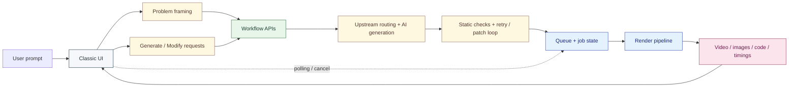
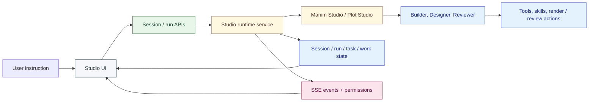

English | [简体中文](https://github.com/Wing900/ManimCat/blob/main/README.zh-CN.md)

<div align="center">

<!-- Top decorative wave -->


<br>


<!-- Cat paw accent -->
<div style="opacity: 0.3; margin: 20px 0;">
  
</div>

<h1>
  <picture>
    
  </picture>
</h1>

<!-- Math symbol divider -->
<p align="center">
  <span style="font-family: monospace; font-size: 24px; color: #90A4AE;">
    ∫ &nbsp; ∑ &nbsp; ∂ &nbsp; ∞
  </span>
</p>

<p align="center">
  <strong>Dual-Mode AI Workspace for Mathematical Visuals</strong>
</p>

<p align="center">
  Combining direct workflow generation with agent-driven studio collaboration, powered by Manim and matplotlib
</p>

<!-- Geometric divider -->
<div style="margin: 30px 0;">
  <span style="color: #CFD8DC; font-size: 20px;">◆ &nbsp; ◆ &nbsp; ◆</span>
</div>

<p align="center">
  
  
  
  
</p>

<p align="center" style="font-size: 18px;">
  <a href="#overview"><strong>Overview</strong></a> •
  <a href="#examples"><strong>Examples</strong></a> •
  <a href="#quick-start"><strong>Quick Start</strong></a> •
  <a href="#technology"><strong>Technology</strong></a> •
  <a href="#deployment"><strong>Deployment</strong></a> •
  <a href="#major-additions"><strong>Additions</strong></a> •
  <a href="#license-and-copyright"><strong>License</strong></a> •
  <a href="#maintenance-notes"><strong>Maintenance</strong></a>
</p>

<br>

<!-- Bottom decorative wave -->


</div>

<br>

## Overview

I am happy to introduce my new project, ManimCat. It is, after all, a cat.

Built on top of [manim-video-generator](https://github.com/rohitg00/manim-video-generator), ManimCat is now a much broader AI-assisted creation system for math teaching visuals rather than just a single generation flow.

It is designed for classroom explanation, worked-example breakdowns, and visual reasoning tasks. You can use natural language to generate, modify, rerender, and organize both animated and static teaching visuals with `video` and `image` outputs.

The project is now organized around three clear axes: `dual-mode`, `dual-engine`, and `dual-studio`.

- `Workflow Mode` is for direct generation and rendering when you want fast outputs
- `Agent Mode` is for Studio-based collaborative work with longer-lived sessions, task state, review, and iteration
- `Manim` is used for animation and timeline-based mathematical storytelling
- `matplotlib` is used in Plot Studio for static math visuals, charts, and teaching figures
- `Plot Studio` is the more mature Studio path today for static visual work and iterative editing
- `Manim Studio` is the animation-oriented Studio path and is still at an earlier stage

### Interface

#### UI

<div align="center">
  
  
</div>

<div align="center">
  
  
</div>

#### Workflow

<div align="center">
  
  
</div>

#### Plot Studio

<div align="center">
  
  
</div>

## Examples

<div align="center">

> *Prove that $1/4 + 1/16 + 1/64 + \dots = 1/3$ using a beautiful geometric method, elegant zooming, smooth camera movement, a slow pace, at least two minutes of duration, clear logic, a creamy yellow background, and a macaroon-inspired palette.*

<br>

<a href="https://github.com/user-attachments/assets/38dba3ba-e29f-458d-b8ea-baf10cade4f1">
  <video src="https://github.com/user-attachments/assets/38dba3ba-e29f-458d-b8ea-baf10cade4f1" width="85%" autoplay loop muted playsinline>
  </video>
</a>

<sub>▲ Generated with BGM · Geometric Series Proof · ManimCat</sub>

</div>

## Quick Start

```bash
npm install
cd frontend && npm install
cd ..
npm run dev
```

Open `http://localhost:3000`. For environment variables and deployment-specific setup, see the [deployment guide](https://github.com/Wing900/ManimCat/blob/main/DEPLOYMENT.md).

If you want a direct Docker deployment path, you can also start from the published image `wingflow/manimcat` instead of building locally first.


## Technology

### Tech Stack

- Product structure: Workflow mode for direct generation, Agent mode for Studio-based collaborative work
- Visual engines: Manim for animation, `matplotlib` for Plot Studio static figures
- Backend: Express + TypeScript, Bull + Redis, OpenAI-compatible upstream routing, Studio agent runtime, optional Supabase history storage
- Frontend: React 19, Vite, Tailwind CSS, classic generator UI, Studio workspace shell, Plot Studio minimal workspace UI
- Agent state model: session / run / task / work / result lifecycle for longer-lived studio interactions
- Realtime layer: polling for Workflow jobs, Server-Sent Events for Agent sessions, permission requests, and task updates
- Rendering runtime: Python, Manim Community Edition, `matplotlib`, LaTeX, `ffmpeg`
- Deployment: Docker / Docker Compose, Hugging Face Spaces

### Workflow Mode



### Agent Mode



For environment variables, deployment modes, and upstream-routing examples, see the [deployment guide](https://github.com/Wing900/ManimCat/blob/main/DEPLOYMENT.md).

## Deployment

Please see the [deployment guide](https://github.com/Wing900/ManimCat/blob/main/DEPLOYMENT.md).

## Major Additions

This project is a substantial rework built on top of the original foundation. The main additions I personally designed and implemented are:

### Generation and Rendering

- Added a dedicated image workflow alongside video generation
- Added `YON_IMAGE` anchor-based segmented rendering for multi-image outputs
- Added two-stage AI generation: a concept designer produces a scene design, then a code generator writes the Manim code
- Added a static analysis guard (`py_compile` + `mypy`) that checks generated code before rendering, with AI-powered auto-patching for up to 3 passes
- Added AI-driven code retry: when a render fails, the error is fed back to the model to regenerate and re-render automatically
- Added rerender-from-code and AI-assisted modify-and-render flows
- Added stage timing breakdown shared by both image and video jobs
- Added background music mixing for rendered videos
- Added render-failure event collection and export for debugging and reliability work

### Product and Interface

- Rebuilt the frontend as a separate React + TypeScript + Vite application
- Added problem framing before generation to help structure user requests
- Added reference image upload support
- Added a unified workspace for generation history and usage views
- Added a usage metrics dashboard with daily charts, success rates, and timing breakdowns
- Added a prompt template manager for viewing and overriding system prompts per role
- Added dark / light theme toggle
- Added a waiting-state 2048 mini-game
- Added a refreshed visual style, settings panels, and provider configuration flows

### Infrastructure and Routing

- Reworked the backend around Express + Bull + Redis
- Added retry, timeout, cancellation, and status-query flows
- Added support for third-party OpenAI-compatible APIs and custom provider configuration
- Added server-side upstream routing by ManimCat key
- Kept optional multi-profile frontend provider rotation for local use
- Added optional Supabase-backed persistent history storage

### Studio Agent

- Added a separate Agent Mode driven by a Studio runtime rather than the classic one-shot generation flow
- Defined the long-lived Studio state model around session / run / task / work / result
- Added builder, designer, and reviewer roles inside the Studio agent system
- Added workspace tools, render tools, local skills, and subagent orchestration
- Added Server-Sent Events for live Studio updates plus permission request / reply handling
- Added Studio review, pipeline, work, and permission panels in the frontend

### Plot Studio and Manim Studio

- Added two distinct Studio workspaces: Plot Studio for `matplotlib`-based static visuals and Manim Studio for animation-oriented workflows
- Added Plot Studio output history browsing, work reordering, and a minimal split workspace layout
- Established the dual-engine product direction: Manim for animated mathematical storytelling, `matplotlib` for static teaching figures and charts

## License and Copyright

Licensing details are defined in `LICENSE_POLICY.md` (Chinese) and `LICENSE_POLICY.en.md` (English).

- Third-party attribution and notices: `THIRD_PARTY_NOTICES.md`
- Chinese third-party notices: `THIRD_PARTY_NOTICES.zh-CN.md`
- Contribution agreement: `CLA.md`
- Contribution guide: `CONTRIBUTING.md`

### CLA Intent Statement

This project uses a CLA so the maintainer can keep commercial-use authorization under a single workflow, instead of requiring separate consent from every contributor each time.

This is not a statement of "project commercialization" as a company path. The maintainer remains a developer, the project stays open source, and the project stance is anti-monopoly.

Any commercial authorization income is intended to be reinvested into project development itself, including support for major contributors and community activities. For small companies that are open-source-friendly, authorization terms and fees are expected to be symbolic.

## Maintenance Notes

Because my time is limited and I am an independent hobbyist rather than a full-time professional maintainer, I currently cannot provide fast review cycles or long-term maintenance for external contributions. Pull requests are welcome, but review may take time.

If you have good suggestions or discover a bug, feel free to open an Issue for discussion. I will improve the project at my own pace. If you want to make large-scale changes on top of this work, you are also welcome to fork it and build your own version.

If this project gave you useful ideas or helped you in some way, that is already an honor for me.

<details>
  <summary><b>If you like this project, you can also buy the author a Coke 🥤</b></summary>
  <br />
  <p>Mainland China:</p>
  
  <br />
  <p>International:</p>
  <a href="https://afdian.com/a/wingflow/plan" target="_blank">
    
  </a>
  <p><i>Thank you. Your support gives me more energy to keep maintaining the project.</i></p>
</details>

## Star History

<a href="https://www.star-history.com/?repos=Wing900%2FManimCat&type=date&legend=top-left">
 <picture>
   <source media="(prefers-color-scheme: dark)" srcset="https://api.star-history.com/image?repos=Wing900/ManimCat&type=date&theme=dark&legend=top-left" />
   <source media="(prefers-color-scheme: light)" srcset="https://api.star-history.com/image?repos=Wing900/ManimCat&type=date&legend=top-left" />
   
 </picture>
</a>

## Acknowledgements

- [rohitg00/manim-video-generator](https://github.com/rohitg00/manim-video-generator)
- [anomalyco/opencode](https://github.com/anomalyco/opencode)
- [Linux.do](https://linux.do)
- [Alibaba Cloud Bailian](https://bailian.console.aliyun.com)


