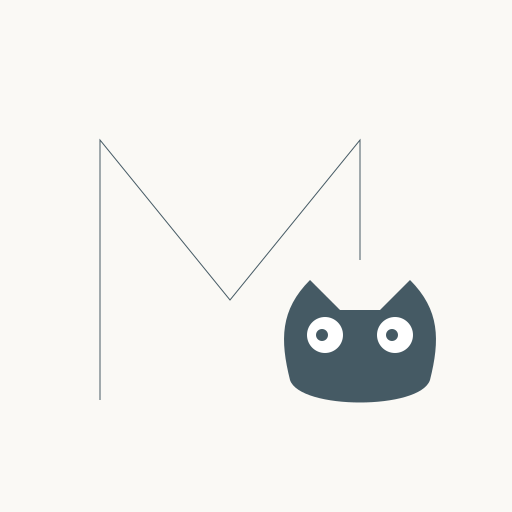
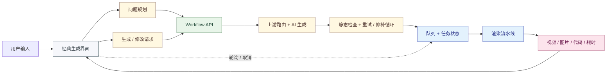
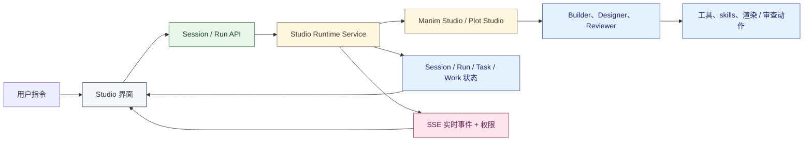

简体中文 | [English](https://github.com/Wing900/ManimCat/blob/main/README.md)

<div align="center">

<!-- 顶部装饰线 - 统一为深灰色调 -->


<br>



<!-- 装饰：猫咪足迹 -->
<div style="opacity: 0.3; margin: 20px 0;">
  
</div>

<h1>
  <picture>
    
  </picture>
</h1>

<!-- 装饰：数学符号分隔 -->
<p align="center">
  <span style="font-family: monospace; font-size: 24px; color: #90A4AE;">
    ∫ &nbsp; ∑ &nbsp; ∂ &nbsp; ∞
  </span>
</p>

<p align="center">
  <strong>面向数学可视化创作的双模式 AI 工作台</strong>
</p>

<p align="center">
  同时支持直接生成工作流与基于 Agent 的 Studio 协作，并由 Manim 与 matplotlib 双引擎支撑
</p>

<!-- 装饰：几何点阵分隔 -->
<div style="margin: 30px 0;">
  <span style="color: #CFD8DC; font-size: 20px;">◆ &nbsp; ◆ &nbsp; ◆</span>
</div>

<p align="center">
  
  
  
  
</p>

<p align="center" style="font-size: 18px;">
  <a href="#项目简介"><strong>项目简介</strong></a> •
  <a href="#样例"><strong>样例</strong></a> •
  <a href="#快速开始"><strong>快速开始</strong></a> •
  <a href="#技术"><strong>技术</strong></a> •
  <a href="#部署"><strong>部署</strong></a> •
  <a href="#在原项目基础上的主要扩展"><strong>主要扩展</strong></a> •
  <a href="#开源与版权声明"><strong>版权</strong></a> •
  <a href="#维护说明"><strong>维护</strong></a>
</p>

<br>

<!-- 底部装饰线 - 统一为深灰色调 -->


</div>

<br>

## 项目简介

很荣幸在这里介绍我的新项目ManimCat，它是~一只猫~

本项目基于 [manim-video-generator](https://github.com/rohitg00/manim-video-generator) 进行了大幅重构与再开发，现在已经不只是单一生成流程，而是一个更完整的 AI 数学教学可视化创作系统。

它面向课堂讲解、例题拆解与数形结合表达等场景，用户可以通过自然语言生成、修改、重渲染并组织动画与静态两类教学可视化内容，支持 `video` 与 `image` 两种输出。

项目现在可以从三个维度理解：`双模式`、`双引擎`、`双 Studio`。

- `Workflow Mode` 用于直接生成与渲染，适合快速产出
- `Agent Mode` 用于基于 Studio 的协作式创作、审阅、任务跟踪与迭代
- `Manim` 负责动画、镜头与时间线驱动的数学叙事
- `matplotlib` 负责 Plot Studio 中的静态数学图像、函数图、图表与教学插图
- `Plot Studio` 是目前更成熟的 Studio 路径，主要面向静态可视化与迭代编辑
- `Manim Studio` 面向动画创作，但目前仍处于相对更早期的阶段

### 界面

#### UI 界面

<div align="center">
  
  
</div>

<div align="center">
  
  
</div>

#### Workflow 界面

<div align="center">
  
  
</div>

#### Plot Studio 界面

<div align="center">
  
  
</div>

## 样例

<div align="center">

> *$1/4 + 1/16 + 1/64 + \dots = 1/3$，证明这个等式，美丽的图形方法，优雅的缩放平稳镜头移动，慢节奏，至少两分钟，逻辑清晰，奶黄色背景，马卡龙色系*

<br>

<a href="https://github.com/user-attachments/assets/38dba3ba-e29f-458d-b8ea-baf10cade4f1">
  <video src="https://github.com/user-attachments/assets/38dba3ba-e29f-458d-b8ea-baf10cade4f1" width="85%" autoplay loop muted playsinline>
  </video>
</a>

<sub>▲ 含背景音乐 · 几何级数证明 · ManimCat 生成</sub>

</div>

## 快速开始

```bash
npm install
cd frontend && npm install
cd ..
npm run dev
```

访问 `http://localhost:3000`。环境变量、部署方式以及上游路由示例请查看[部署文档](https://github.com/Wing900/ManimCat/blob/main/DEPLOYMENT.zh-CN.md)。

如果你直接用 Docker 镜像部署，也可以从 `wingflow/manimcat` 开始，而不是自行本地构建。


## 技术

### 技术栈

- 产品结构：Workflow 模式用于直接生成，Agent 模式用于 Studio 协作式工作流
- 图形引擎：Manim 用于动画，`matplotlib` 用于 Plot Studio 静态图像
- 后端：Express + TypeScript、Bull + Redis、兼容 OpenAI 的上游路由、Studio Agent 运行时、可选 Supabase 历史记录
- 前端：React 19、Vite、Tailwind CSS、经典生成界面、Studio 工作台界面、Plot Studio 极简工作区 UI
- Agent 状态模型：围绕 session / run / task / work / result 组织长生命周期 Studio 交互
- 实时层：Workflow 任务使用轮询，Agent 会话使用 Server-Sent Events 推送事件、权限请求与任务更新
- 渲染运行时：Python、Manim Community Edition、`matplotlib`、LaTeX、`ffmpeg`
- 部署：Docker / Docker Compose、Hugging Face Spaces

### Workflow Mode



### Agent Mode



## 部署

请查看[部署文档](https://github.com/Wing900/ManimCat/blob/main/DEPLOYMENT.zh-CN.md)。

## 在原项目基础上的主要扩展

这个项目是在原始基础上做的大幅重构与再开发。以下是我本人新增和重构的核心能力：

### 生成与渲染

- 在视频生成之外，新增了独立的图片工作流
- 新增 `YON_IMAGE` 锚点分块渲染，支持多图输出
- 新增两阶段 AI 生成架构：概念设计者生成场景方案，再由代码生成者产出 Manim 代码
- 新增静态检查守卫（`py_compile` + `mypy`），渲染前自动检查生成代码，并由 AI 自动修补，最多循环 3 轮
- 新增 AI 驱动的代码重试：渲染失败后自动将错误反馈给模型，重新生成并再次渲染
- 新增基于现有代码的重渲染，以及 AI 辅助修改后再渲染
- 新增图片与视频共用的阶段耗时统计
- 新增视频背景音乐自动混入
- 新增渲染失败事件采集与导出能力，便于排错和稳定性改进

### 产品与界面

- 将前端重建为独立的 React + TypeScript + Vite 应用
- 新增生成前的问题规划能力，帮助整理用户请求
- 新增参考图上传能力
- 新增统一的工作空间页面，整合生成历史与用量视图
- 新增用量仪表盘，提供每日调用量、成功率与耗时趋势图表
- 新增提示词模板管理，可按角色查看和覆盖系统提示词
- 新增暗色 / 亮色主题切换
- 新增长等待过程中的 2048 小游戏
- 新增整体视觉风格、设置面板与 provider 配置流程

### 基础设施与路由

- 将后端重构为 Express + Bull + Redis 架构
- 新增重试、超时、取消与状态查询链路
- 新增对第三方 OpenAI-compatible API 与自定义 provider 的支持
- 新增按 ManimCat key 的服务端上游路由能力
- 保留并扩展前端多 profile provider 轮询能力，便于本地使用
- 新增可选的 Supabase 持久化历史记录存储

### Studio Agent

- 新增独立的 Agent Mode，它不再只是经典生成流程的附属页面，而是单独的 Studio runtime 工作模式
- 定义了围绕 session、run、task、work、result 的长生命周期 Studio 状态模型
- 新增 builder、designer、reviewer 三种 Studio agent 角色
- 新增工作区工具、渲染工具、本地 skills 与子代理编排能力
- 新增基于 Server-Sent Events 的 Studio 实时更新，以及权限请求 / 回复链路
- 新增 Studio 前端中的 review、pipeline、work、permission 等面板

### Plot Studio 与 Manim Studio

- 新增两个明确分化的 Studio 工作区：Plot Studio 面向 `matplotlib` 静态可视化，Manim Studio 面向动画工作流
- 新增 Plot Studio 的历史产物浏览、工作项重排与极简分栏工作区布局
- 明确形成双引擎产品方向：Manim 负责动态数学叙事，`matplotlib` 负责静态教学图像与图表

##  开源与版权声明 

本项目授权细则见 `LICENSE_POLICY.md`。

*   第三方来源与归属说明见 `THIRD_PARTY_NOTICES.md`。
*   中文版第三方来源与归属说明见 `THIRD_PARTY_NOTICES.zh-CN.md`。
*   贡献者许可协议见 `CLA.md`。
*   贡献说明见 `CONTRIBUTING.md`。

### CLA 目的说明

本项目引入 CLA，是为了让维护者能够集中管理项目的商业使用授权，避免每次商业授权都需要逐一联系所有贡献者。

这不代表项目会走向公司化商业运营。维护者始终以开发者身份维护项目，不以成为 ManimCat 公司的老板或经理为目标。项目将长期保持开源立场，反对垄断。

若存在商业授权收入，资金将优先回馈项目本身，包括对项目基础建设、文档与测试完善、社区活动组织，以及对作出重大贡献开发者的支持。对于乐于开源、愿意回馈社区的小型商业公司，授权条款与费用将以象征性为主。

## 维护说明

由于作者精力有限（个人业余兴趣开发者，非专业背景），目前完全无法对外部代码进行有效的审查和长期维护。因此，本项目欢迎 PR，不过代码审查周期长。感谢理解。

如果你有好的建议或发现了 Bug，欢迎提交 Issue 进行讨论，我会根据自己的节奏进行改进。如果你希望在本项目基础上进行大规模修改，欢迎 Fork 出属于你自己的版本。

如果你觉得有启发与帮助，那是我的荣幸。


<details>
  <summary><b>如果你觉得这个作品很好，也欢迎请作者喝可乐🥤</b></summary>
  <br />
  <p>中国大陆用户：</p>
  
  <br />
  <p>海外用户：</p>
  <a href="https://afdian.com/a/wingflow/plan" target="_blank">
    
  </a>
  <p><i>感谢你的支持，我会更有动力维护这个项目！</i></p>
</details>

## Star History

<a href="https://www.star-history.com/?repos=Wing900%2FManimCat&type=date&legend=top-left">
 <picture>
   <source media="(prefers-color-scheme: dark)" srcset="https://api.star-history.com/image?repos=Wing900/ManimCat&type=date&theme=dark&legend=top-left" />
   <source media="(prefers-color-scheme: light)" srcset="https://api.star-history.com/image?repos=Wing900/ManimCat&type=date&legend=top-left" />
   
 </picture>
</a>

## 致谢

- [rohitg00/manim-video-generator](https://github.com/rohitg00/manim-video-generator)
- [anomalyco/opencode](https://github.com/anomalyco/opencode)
- [Linux.do](https://linux.do)
- [阿里云百炼](https://bailian.console.aliyun.com)


